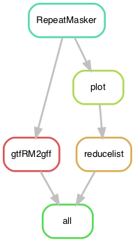

# RepeatsMarasmius: Small pipeline to repeat mask *Marasmius oreades* genomes

The objective is to produce gtf/gffs of repeats in input genomes plus a few descriptive plots. 

As it is, the pipeline expects the genomes to have a name like "{sample}.fa", where {sample} is the name of each strain/individual.

## Building the environment

I ran the pipeline under a [Conda](https://docs.anaconda.com/) environment. Install it first. If you like, you can start by updating it.

    $ conda update -n base conda

To create the environment arbitrarily named `SpecificTE`:

    $ conda create -n SpecificTE -c bioconda snakemake-minimal=5.8.1

To install software, activate the environment.

    $ conda activate SpecificTE

This environment is the same one used in the next pipeline (`SpecificTE.smk`), but only these packages are important:

Now install:

    $ conda install -c bioconda samtools=1.10
    $ conda install -c bioconda blast=2.10.1
    $ conda install biopython=1.77
    $ conda install -c bioconda repeatmasker=4.0.7

Other things installed in the environment in `SpecificTE.smk` but not used by this pipeline:

    $ conda install -c bioconda bedtools=2.29.2
    $ conda install -c bioconda mafft=7.407
    $ conda install numpy=1.19.1

In addition I use a little environment for an R rule for plotting. I like to keep them separately to avoid conflicts:

    $ cat envs/plotr.yaml
```yaml
    channels:
      - bioconda
      - defaults
      - conda-forge
      - r # Some dependencies do not work together when I set this
    dependencies:
      - r-cowplot=1.0.0 # it comes with ggplot2 3.1.1
      - r-tidyr=1.1.0 # included dplyr 1.0.0
      # - r-naturalsort=0.1.3
```

## Necessary scripts

The pipeline does a few extra thing other than just running RepeatMasker. This was mostly for vanity... to do so, you require two scripts available in another [GitHub repository](https://github.com/SLAment/Genomics):

* `gtfRM2gff.py` available [here](https://github.com/SLAment/Genomics/blob/master/GenomeAnnotation/gtfRM2gff.py)
* `totalcovergff.py` available [here](https://github.com/SLAment/Genomics/blob/master/GenomeAnnotation/totalcovergff.py)

A third script is already in this repo (`scripts/RepeatsMar.R`)

## The configuration file

The configuration file contains the paths to the necessary files to run the pipeline.

    $ cat RepeatsMarasmius_config.yaml
```yaml
# Configuration file of RepeatsMarasmius.smk
# ==================================================
# Sandra Lorena Ament Velasquez, based on Valentina Peona's SpecificTE pipeline
# Johannesson Lab, Evolutionary Biology Center, Uppsala University, Sweden
# 2020/07/17
# +++++++++++++++++++++++++++++++++++++++++++++++++

## All samples
SampleIDs: ["E1", "W6", "N11", "S3", "E2", "W9", "N18", "S1"]

## Path to assemblies
path2data: "/mnt/sda/johannesson_lab/marasmius/lores_work/data/ScaffoldedAssemblies"

## TE library
TElib: "data/maror.repeatlib2.0.fasta"

## Scripts
gtfRM2gff: "/home/lore/scripts/Genomics/GenomeAnnotation/gtfRM2gff.py"
totalcovergff: "/home/lore/scripts/Genomics/GenomeAnnotation/totalcovergff.py"
RepeatsMar: "scripts/RepeatsMar.R"

## Environments
plotr: "envs/plotr.yaml"

## Parameters
mincount: 0 # Minimum count of a TE in the RepeatMasker output to be reatained per sample
outprefix: "allsamples"
```

**Important:** Notice that the TElibrary codes the missing data as `N`, not `?`, and that the LTR elements are NOT split into the internal part ("xxxx_i") and the LTR part itself, as in a traditional RepeatMasker library. This is kept intentional so that the pipeline works better with LTR elements, rather than creating artifacts with *solo* and tandem LTRs.

## Run pipeline locally

Get into the folder with this repo's content, for example:

    $ cd /mnt/sda/johannesson_lab/marasmius/lores_work/RepeatsMarasmius
    $ conda activate SpecificTE

First, to get an idea of how the pipeline looks like we can make a rulegraph:

    $ snakemake --snakefile RepeatsMarasmius.smk --configfile RepeatsMarasmius_config.yaml --rulegraph | dot -Tpng > rulegraph.png



If you want to make sure that all the input files are placed correctly you can check with:
    
    $ conda activate SpecificTE
    $ snakemake --snakefile RepeatsMarasmius.smk --configfile RepeatsMarasmius_config.yaml -pn

If that step above didn't complain and you feel ready, you can finally run the pipeline. I like to make a screen first, then activate the environment, and finally run the pipeline in the background.

    $ screen -R SpecificTE
    $ conda activate SpecificTE
    $ snakemake --snakefile RepeatsMarasmius.smk --configfile RepeatsMarasmius_config.yaml -p -j 24 --keep-going --use-conda &> RepeatsMarasmius.log &

Notice `-j` stands for the number of threads that you want to give to your pipeline. See [Snakemake](https://snakemake.readthedocs.io/en/stable/) documentation for more information. Notice I'm using `--use-conda`! 

## Results

The results are both the RepeatMasker output (in gtf and gff format) and a list of repeats that have a minimum threshold count across all samples (specified with `mincount` in the configuration file). It also produces a histogram of count distribution for each sample.

I ran the pipeline independently for the two mating types.
